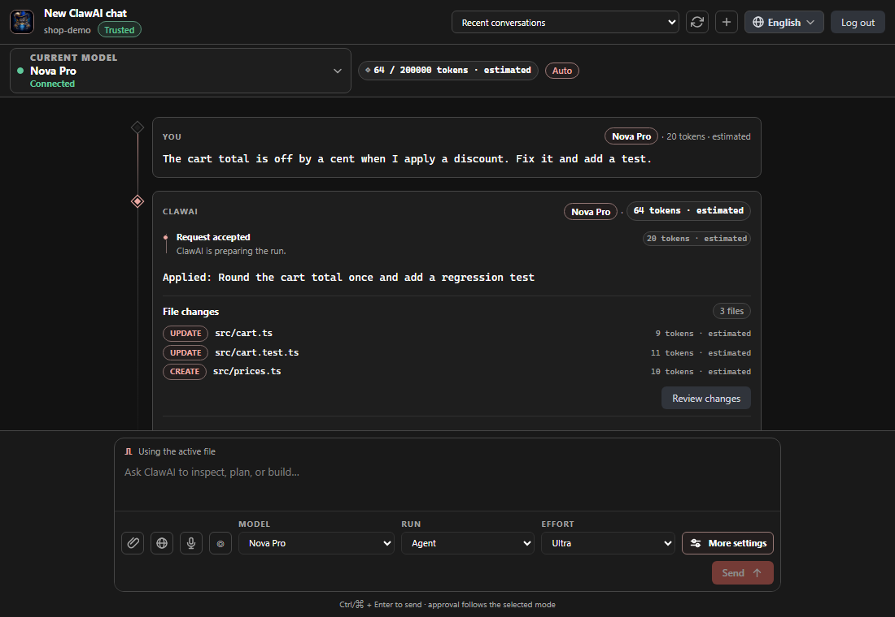
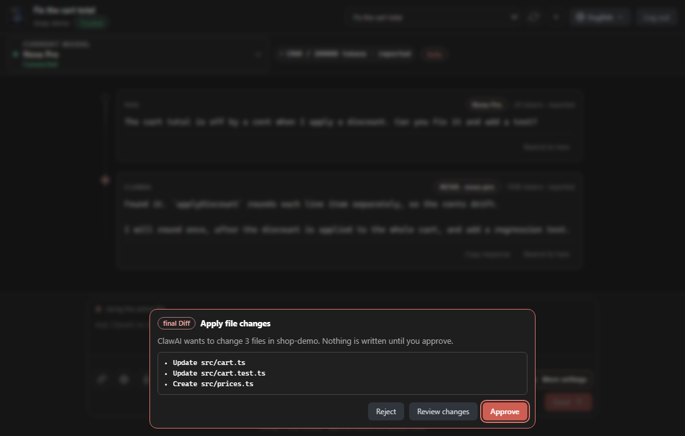
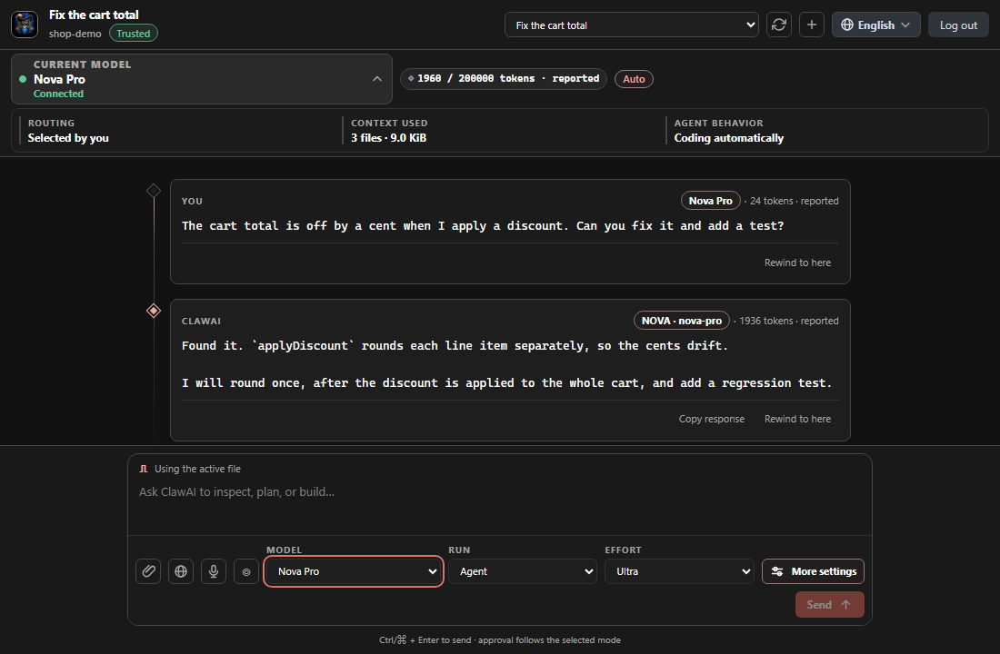
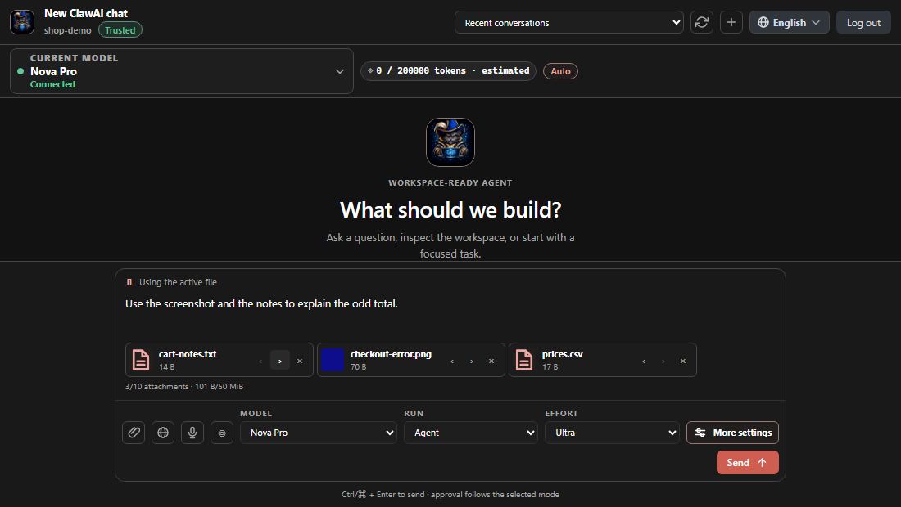
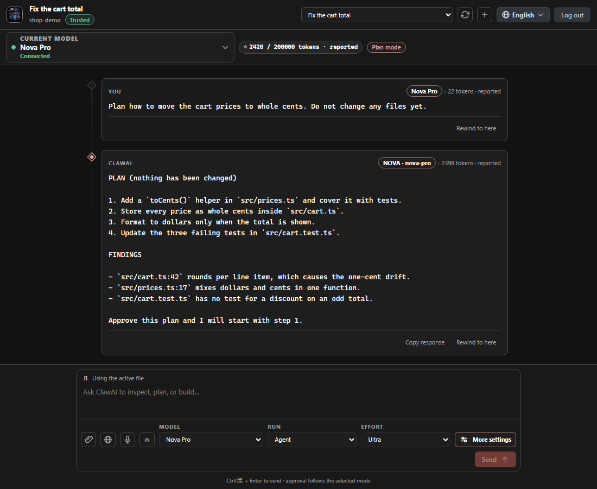
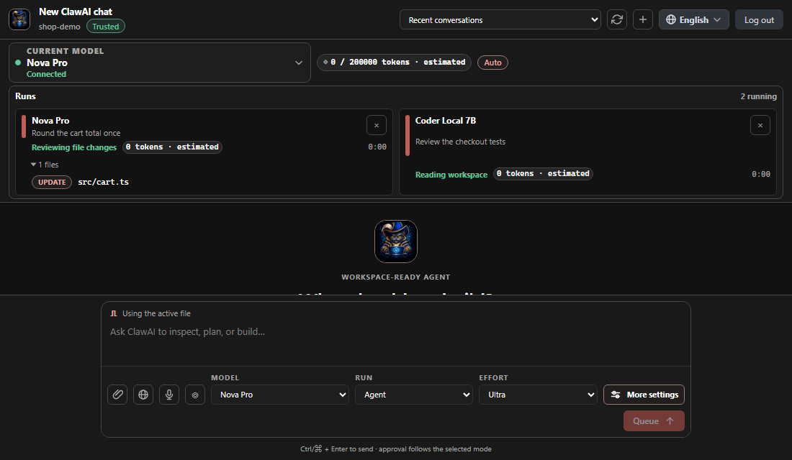

# ClawAI Coding Agent for VS Code

**Every AI, one workspace — right inside VS Code.**

ClawAI Coding Agent puts a chat and a coding agent in your editor. Ask a
question, fix a bug, write tests, or hand over a bigger task. It reads your
project, proposes changes, and waits for your OK before it touches a file.

It connects to your ClawAI account, so you can use many AI models from one
place: hosted models, or models running on your own machine.

Version 1.93.0 delivers a more capable agent that can plan, edit files, run
commands, use git, and drive a browser, all with your approval, and it keeps
working with the classic chat-and-review flow if a newer feature is not
available on your ClawAI server. The approval choices now mean what they say
(Strict asks every time, Plan can still read your workspace), the chat box
remembers Run, Context and Web research, and in Plan mode the agent answers
that it cannot write instead of stopping with an error. Compare and
Compare + Judge now show one card per model as each model starts and fill it
while it writes, then show the judge's verdict with a winner, ranks and scores
the moment it is ready. Scheduled tasks can now follow a calendar
(for example weekdays at 9:00), and commands sent to a runner machine run with
your sandbox setting and without your editor's private environment. The
command-line agent can now be set up like the chat box (effort, what it is
shown first, which web tools it may use, and how much it may do without
asking), and the agent can read several pages of one website.

## Why use it

- **You stay in control.** You see every change as a diff before it is applied,
  and you can undo it.
- **Pick your model, or let ClawAI pick.** Use automatic routing, or choose a
  cloud or local model yourself.
- **Safe by default.** Secret files are never read, commands are limited, and
  approvals are on until you say otherwise.
- **Works with your project.** It understands your files, selection, git state,
  and your own project rules.
- **Private.** Sign-in happens in your browser. A zero-retention mode keeps
  run history in memory and asks the server not to keep your content.
- **Your language.** The interface comes in 13 languages, including right-to-left
  Arabic and Persian.

## What you can do

### Chat and agent

- Chat in the ClawAI panel, in an editor tab, or with `@clawai` in VS Code Chat.
- Keep several chats open at once, and run two at the same time with different
  models.
- Choose **Auto** (the agent acts, with your approvals) or **Plan mode**
  (read-only: it thinks and suggests, but changes nothing).
- Compare two to five models on the same question, then ask a judge model to
  pick the best answer.
- Ask about a selection, the current file, or your whole workspace. Type
  `src/app.ts:10-40` in a message to pull in exactly those lines.
- Ask a quick side question without derailing the main task.
- Choose how answers are written: default, concise, explanatory, or learning.

### Files and code changes

- Generate code, fix a selection, review code, write tests, write docs, make a
  plan, or audit the whole workspace.
- Review changes as a normal VS Code diff before anything is written.
- Undo your last ClawAI edits, step by step.
- Create checkpoints and restore them later, or rewind a conversation to an
  earlier point.

### Running commands safely

- The agent can run development commands (tests, builds, linters) in a visible
  VS Code terminal that you can cancel.
- Commands are checked first. Dangerous or unknown ones are refused or need
  your approval.
- Optional sandbox: run commands inside your operating system's sandbox or a
  Docker container, with network access off unless you turn it on.
- The agent can open pages in a browser to check your web app, and you can
  attach what it saw to your chat.

### Approvals and permission modes

Pick the **Approval** level under **More settings** in the chat box:

- **Plan:** read-only. Anything that changes something is refused.
- **Ask for Approval:** the default. You approve each change and command.
- **Auto Edit:** routine file edits go through. Commands and riskier actions
  still ask.
- **Autonomous Scoped:** routine edits and commands inside the workspace go
  through. Committing, pushing, deleting and MCP calls still ask. Writing
  outside the workspace is refused in every level, never offered for approval.
- **Strict:** asks like Ask for Approval, and refuses deleting, production and
  admin-level actions.

No level skips Workspace Trust or secret-file protection, and you can always
cancel. On an approval card, **Always allow in this workspace** remembers your
choice for that trusted workspace.

### Sessions, history and resume

- Your conversations are saved. Reopen, rename, archive, group, or restore
  them, and open one in a new window.
- Search your run history, export a transcript, and see a session recap.
- Resume a conversation that started somewhere else, such as the ClawAI web app.
- Long chats can be summarized (compacted) so they can keep going.
- See how much you have used with **ClawAI: Show Usage**.

### Attachments: images, PDF and voice

- Paste, drop, or pick screenshots, images, videos, documents, PDFs, and source
  files into the message box.
- Attach terminal output with one command.
- Dictate your message by voice in the composer. If your setup does not allow
  it, ClawAI tells you how to use your system's dictation instead.
- Files whose names look like secrets (such as `.env` or `id_rsa`) are refused.

### Git and pull requests

- The agent can look at your git changes, make commits, and help prepare pull
  requests when you allow git.
- Post a code review comment to GitHub or GitLab straight from VS Code.
- Optional Slack notifications about your runs.

### Plugins, MCP and skills

- Add tools with **MCP servers** (local or remote) in your settings.
- Browse, install, enable, and disable **plugins** from plugin marketplaces.
- Teach ClawAI your project with **skills**, rules, and named sub-agents kept in
  a `.clawai` folder. Create it with **ClawAI: Initialize .clawai**.
- Run your own commands at set points in a run with hooks.

### Workflows and scheduled tasks

- Run saved workflows from the Command Palette.
- Manage scheduled tasks and cloud routines that run on their own.
- Run a remote job on demand.

### Remote and command-line use

- Start a cloud coding session, or register your machine as a runner.
- Pair the editor with your phone from a QR code, then run jobs you created for
  the paired device.
- Let ClawAI send commands to this editor after you confirm each one.
- A command-line runner (`clawai -p "your task"`) is included in the extension
  (`dist/headless.mjs`) for scripts and CI. It needs Node.js 22.13 or newer and
  a ClawAI credential in environment variables.
- Some of these need a ClawAI backend that supports them, or a second machine.
  See [Remote and automation](docs/guide/remote-and-automation.md).

### Privacy and zero-retention

- You sign in through your browser. The extension never sees your password.
- Tokens are kept in VS Code's secure storage, never in settings or files.
- Turn on **Zero data retention** to keep run history in memory only, ask the
  server not to keep your content, and block uploads and sharing.
- Nothing is sent to a telemetry service unless you set one up yourself.

## Requirements

- VS Code 1.98 or newer.
- A ClawAI account and a ClawAI server you can reach: **Local**
  (`https://claw.local`) or **Cloud** (`https://claw-ai.co`), or your own.
- A trusted workspace to let ClawAI change files. In an untrusted workspace,
  chat and read-only review still work.
- Optional: Docker, if you want commands to run in a container.

## Quick start

1. **Install** ClawAI Coding Agent from the VS Code Marketplace.
2. **Open the claw icon** in the Activity Bar, or press `Ctrl+Shift+A`
   (`Cmd+Shift+A` on macOS).
3. **Pick a server** on the connection screen: Local, Cloud, or Custom.
4. **Choose Connect to ClawAI.** Your browser opens. Sign in and approve VS
   Code. You never type a password into the extension.
5. **Ask something.** Try "explain this file", or select some code and press
   `Ctrl+Shift+Enter`. Keep **Automatic routing** on, or pick a model.

## Commands and shortcuts

Open the Command Palette (`Ctrl+Shift+P`) and type `ClawAI`.

| Command                        | Shortcut (Windows/Linux)       | macOS shortcut                |
| ------------------------------ | ------------------------------ | ----------------------------- |
| ClawAI: Open Chat              | `Ctrl+Shift+A`                 | `Cmd+Shift+A`                 |
| ClawAI: Ask About Selection    | `Ctrl+Shift+Enter` (selection) | `Cmd+Shift+Enter` (selection) |
| ClawAI: Select Model           | `Ctrl+Alt+M`                   | `Cmd+Alt+M`                   |
| ClawAI: Review Selected Code   | `Ctrl+Alt+R`                   | `Cmd+Alt+R`                   |
| ClawAI: Generate Tests         | `Ctrl+Alt+U`                   | `Cmd+Alt+U`                   |
| ClawAI: Fix Selected Code      | `Ctrl+Alt+X` (selection)       | `Cmd+Alt+X` (selection)       |
| ClawAI: Cancel Active Request  | `Ctrl+Alt+Escape`              | `Cmd+Alt+Escape`              |
| ClawAI: Undo Last ClawAI Edit  | `Ctrl+Alt+Z`                   | `Cmd+Alt+Z`                   |
| ClawAI: Search Run History     | `Ctrl+Alt+H`                   | `Cmd+Alt+H`                   |
| ClawAI: Reopen Closed Chat     | `Ctrl+Alt+T`                   | `Cmd+Alt+T`                   |
| ClawAI: Toggle Focus View      | `Ctrl+Alt+F`                   | `Cmd+Alt+F`                   |
| ClawAI: Compare Models         | none                           | none                          |
| ClawAI: Generate Plan          | none                           | none                          |
| ClawAI: Audit Workspace        | none                           | none                          |
| ClawAI: Initialize .clawai     | none                           | none                          |
| ClawAI: Create Checkpoint      | none                           | none                          |
| ClawAI: Manage Plugins         | none                           | none                          |
| ClawAI: Manage Scheduled Tasks | none                           | none                          |
| ClawAI: Show Usage             | none                           | none                          |
| ClawAI: Show Logs              | none                           | none                          |

Keyboard shortcuts marked "(selection)" work while text is selected in the
editor. Review Selected Code and Generate Tests work while an editor has focus. You can also right-click a selection to ask, fix, or review it.

## Settings that matter

Open Settings and search for `clawAI`.

| Setting                                      | What it does                                                                |
| -------------------------------------------- | --------------------------------------------------------------------------- |
| `clawAI.backendEnvironment`                  | Local, Cloud, or Custom server. Use `clawAI.backendCustomUrl` for a custom. |
| `clawAI.permissionMode`                      | How much ClawAI must ask before it acts.                                    |
| `clawAI.agentMode`                           | Automatic execution, or read-only planning.                                 |
| `clawAI.routingMode`                         | Automatic model choice, or a strategy such as local-only or cost saver.     |
| `clawAI.effortMode`                          | How much work a single run may do, from low to ultra.                       |
| `clawAI.zeroDataRetention`                   | Keep run history in memory only and ask the server not to keep content.     |
| `clawAI.commandSandbox.mode`                 | Run agent commands in an OS sandbox or Docker.                              |
| `clawAI.exclude`                             | Files ClawAI must never read as context.                                    |
| `clawAI.maxContextFiles` / `maxContextBytes` | How much of your project goes into one request.                             |
| `clawAI.autosave`                            | Save your unsaved files before a reviewed edit.                             |
| `clawAI.outputStyle`                         | How answers are written.                                                    |

Secrets such as tokens and API keys are never settings.

## FAQ and troubleshooting

**I can't connect.**
Check the server address on the connection screen. Local is
`https://claw.local` and Cloud is `https://claw-ai.co`. Non-local servers
must use `https://`. Run **ClawAI: Show Logs** for details.

**The browser opens but VS Code stays signed out.**
Approve the request in the browser tab, then return to VS Code. If it
still fails, run **ClawAI: Log Out**, then connect again.

**ClawAI will not edit my files.**
Trust the workspace (VS Code shows a banner or use **Workspaces: Manage
Workspace Trust**). In an untrusted workspace ClawAI only chats and reviews.

**A command was refused.**
Commands are checked for safety. Approve it when asked, or check that you are
in the right permission mode. Secret files and paths outside your workspace are
always blocked.

**I don't see any models.**
Run **ClawAI: Refresh Models**. Your account decides which models you can use.

**How do I undo what the agent did?**
Run **ClawAI: Undo Last ClawAI Edit** (`Ctrl+Alt+Z`), or restore a checkpoint.

## See it in action

These pictures use made-up sample data. Each one also comes in a light version
in the same folder.

## Help and links

- Report a problem or ask a question: use **ClawAI: Send Feedback**, or open an
  issue on [GitHub](https://github.com/ihabkhaled/ClawAI-Coding-Agent/issues).
- What changed: [CHANGELOG](CHANGELOG.md).
- Security and privacy: [SECURITY.md](docs/SECURITY.md).
- Project rules and skills: [the `.clawai` folder guide](docs/CLAWAI_FOLDER_SPEC.md).
- Technical details for developers: [ARCHITECTURE](docs/ARCHITECTURE.md).

## License

[MIT](LICENSE)
